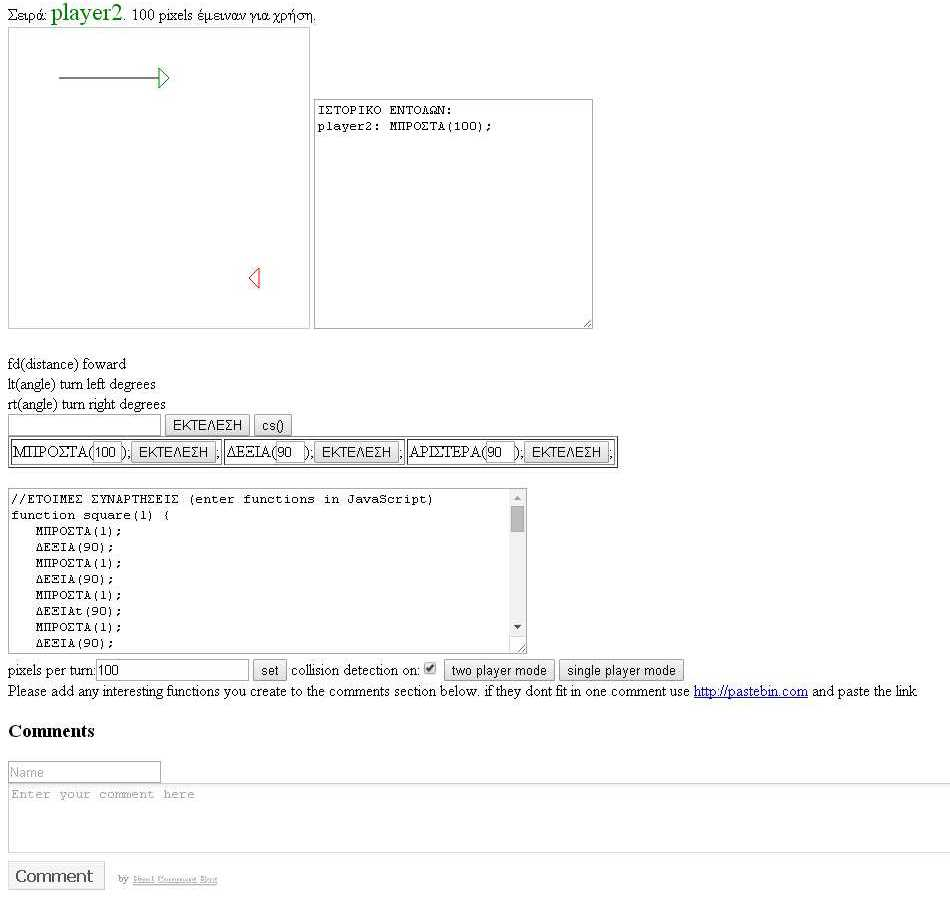

# turtletron-gr

This game is simillar to tron's light cycle game, except it is turn based and uses a programming system simillar to logo's but it is really JavaScript

This is a translated version of amigojapan/Logo-Programming-Game .
My thanks to the original author

Issues:
-Functions (square,stair etc..) produce an error.
-Must add more buttons to minimise manual user typing

